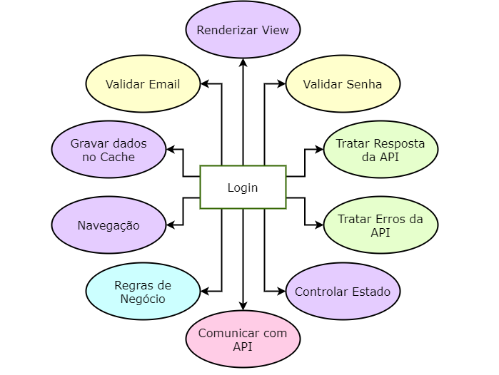
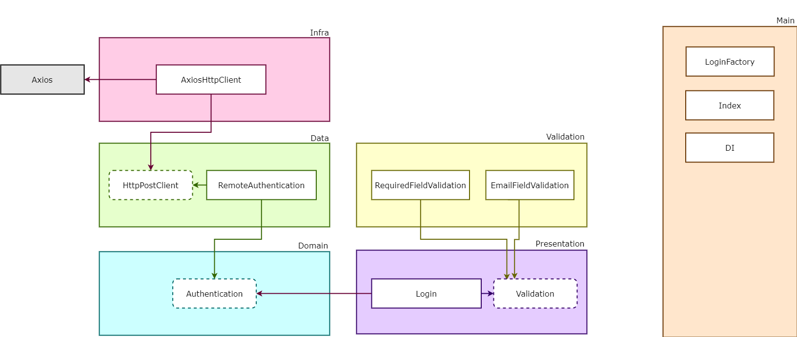

# Clean Front-end 

## Description

This project aims to show how to apply clean architecture with front end projects using [React](https://reactjs.org/).

## Motivation

Below is a diagram of how most projects work.

Using clean architecture we can reach a system that allows changes and extensions in a simpler way and at a lower cost.

